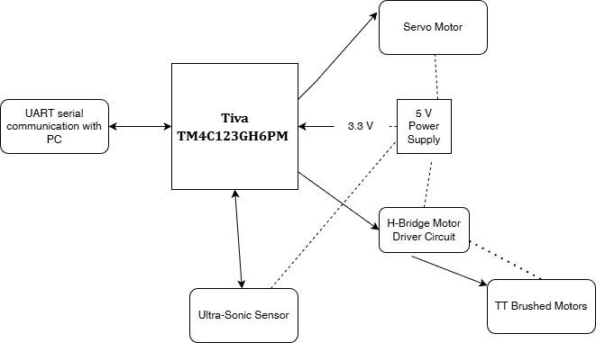

# Introduction

This project utilizes the Texas Instruments Tiva TM4C123GH6PM microcontroller to design a remote-controlled (RC) vehicle. The vehicle will be controlled by commands using serial communication(Teraterm emulator). Additionally, a servo motor, two TT brushed motors, an ultra-sonic sensor and an H-bridge circuit to drive the wheels will be used as peripherals for the vehicle, and they will all be controlled using the Tiva TM4C123GH6PM microcontroller.

# Background and Methodology

The goal of this project is to build a remote-control vehicle that can be control using UART(Universal Asynchronous Receiver Transmitter) protocol to communicate with the vehicle using serial communication(Teraterm). The RC vehicle will have a servo motor that will control the steering of the front wheels of the vehicle. The servo motor will be controlled by using PWM(Pulse Width Modulation), and this will allow the servo to rotate from 0 to 180 degrees, allowing us to  make right and left turns for the vehicle. Two brushed motors will be connected to an H-bridge motor driver circuit board, allowing the vehicle to move forward and backwards. Lastly, an ultrasonic sensor will be utilized automatically stop the vehicle when an object is detected at 10cm, and then the user will be able to redirect the vehicle to a different location. 

The servo motor is connected to PWM2 pin PB4. The H-bridge motor driver is connected to PWM0 pins PB7 and PB6. The ultra sonic sensor is connected to GPIO pins PC4 and PC5. Serial communication using UART is Pin PA0 and PA1.

# Block Diagram

# Components Used

| Description |	Quantity |	Manufacturer |
|-------------|----------|---------------|
| Tiva TM4C123GH6PM |	1 |	Texas Instruments |
| TT brushed motors |	2 | XINXXR |
| Micro Servo Motor SG90 9g | 1 | DORHEA |
| H-Bridge Circuit Motor Driver L298N |	1 | HILETGO |
| Ultra-Sonic Sensor HC-SR04 | 1 |	EPLZON |

# Pinout Used

| Servo Motor PWM2 | Motor Driver\nPWM 0 | TT Motor/PWM0 | Ultra-Sonic Sensor/nGPIO | UART0|
| ----------- | ------------ | -------- | ------------------ | ---- |
| PB4         |	PB7          | PB7      | PC4                | PA0  |
|	          | PB6          | PB6      | PC5	             | PA1  |
| 5v          | 5v           | Motor driver  | 5v            |      |

